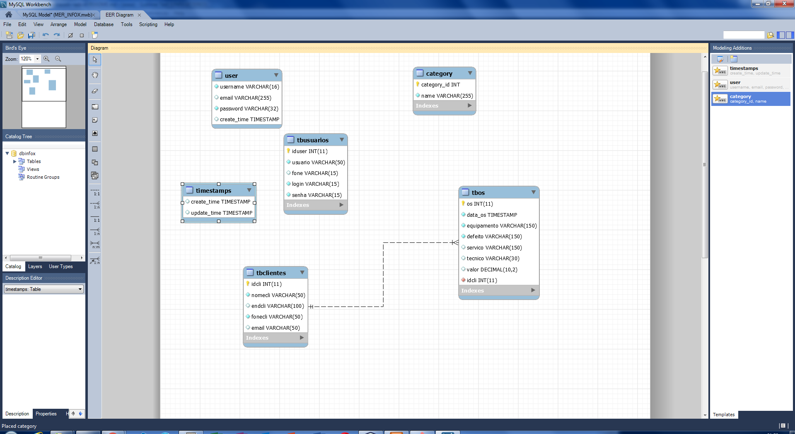
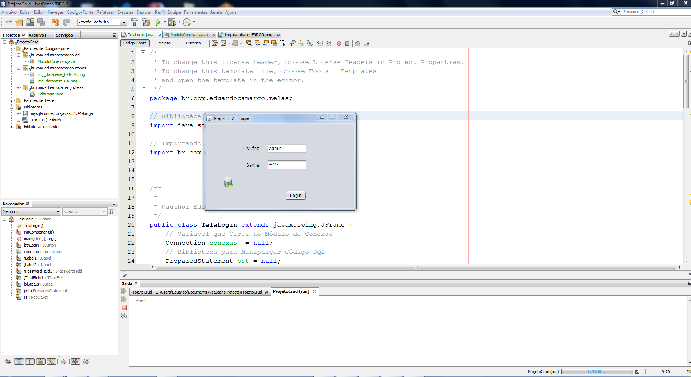
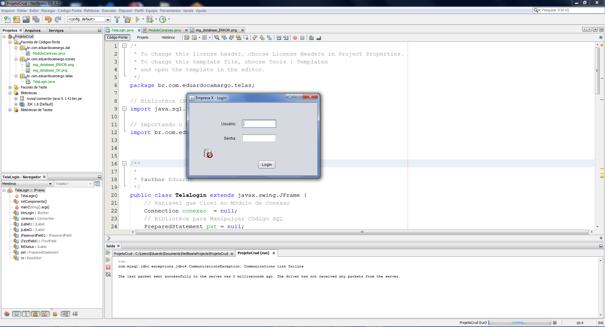

## LINGUAGEM E IDE

Java 1.8
IDE: NetBeans 8.2

## AUTOR

Autor: Eduardo Camargo
E-mail: educamargomt@gmail.com
Site: eduardocamargo.com.br

## RESUMO
Desenvolvimento de um sistema de Ordem de Serviço em JAVA,
utiliznado banco de dados MySQL.

Função de: 

Cadatro de Clintes (CRUD)
Ordem de Servilo (CRUD)
Gerenciamento de relatórios (CRUD)

ATENÇÃO
Objetivo exclusivamente didático/educacional,
para Treinamento em JAVA.

## IMAGEM EXEMPLO

 

 

