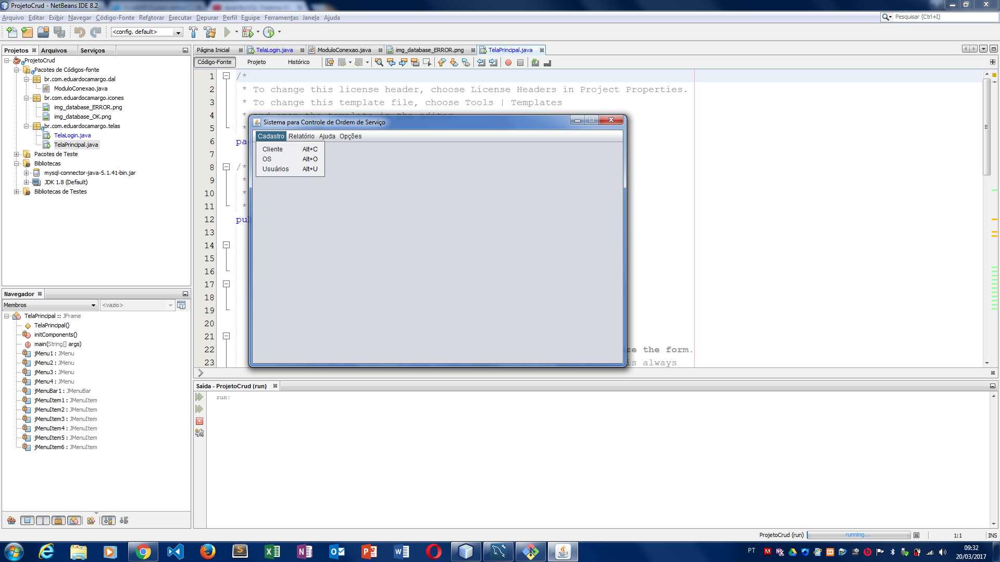

## LINGUAGEM E IDE

Java 1.8
IDE: NetBeans 8.2

## AUTOR

Autor: Eduardo Camargo
E-mail: educamargomt@gmail.com

Esse projeto faz parte do curso java,
do Site Aula: AULAEAD.

Créditos: http://aulaead.com/course/curso-de-java/

Estou realizando as etapaas passo a passo,
escrevendo para treinar.

## RESUMO
Desenvolvimento de um sistema de Ordem de Serviço em JAVA,
utiliznado banco de dados MySQL.

Função de: 

Cadatro de Clintes (CRUD)
Ordem de Servilo (CRUD)
Gerenciamento de relatórios (CRUD)

ATENÇÃO
Objetivo exclusivamente didático/educacional,
para Treinamento em JAVA.

## IMAGEM EXEMPLO

<h2> Atualização (Tela Principal)</h2>

 

 

 

